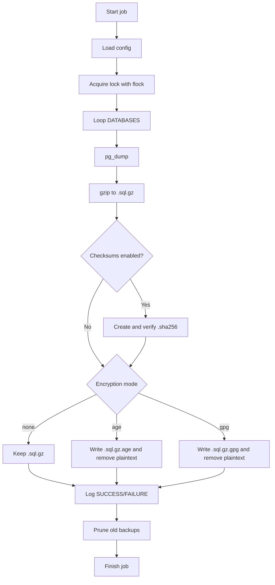

# PostgreSQL Vault

Reliable, secure, and automation-ready PostgreSQL logical backups for Linux.


[](https://github.com/MarkChisholm-dev/PostgreSQL_Vault/actions/workflows/ci.yml)

---

## Why This Exists

`PostgreSQL Vault` is a hardened backup script focused on production-friendly defaults:

- Strict Bash safety options (`set -Eeuo pipefail`)
- Config-first setup (`/etc/postgresql/pg_backup.conf`)
- Optional integrity checks (SHA-256)
- Optional encryption (`age` or `gpg`)
- Locking to prevent concurrent runs
- Log-driven operations with clear status events
- Automated retention cleanup

---

## At A Glance

| Capability | Included |
|---|---|
| Multi-database backup | Yes (`DATABASES=(...)`) |
| Compressed output | Yes (`.sql.gz`) |
| Checksum generation + verification | Yes (`.sha256`) |
| Encryption | Optional (`age` / `gpg`) |
| Retention pruning | Yes (`find -mtime +N`) |
| Concurrency protection | Yes (`flock`) |
| External config override | Yes (`CONFIG_FILE`) |

---

## Backup Flow



---

## Continuous Integration

GitHub Actions runs on every push to `main` and every pull request.

Pipeline coverage:

- Bash syntax validation (`bash -n`)
- Static analysis (`shellcheck`)
- Format enforcement (`shfmt -d`)
- Integration test against PostgreSQL 16 service container

Workflow file:

- `.github/workflows/ci.yml`

---

## Quick Start

### 1) Make script executable

```bash
chmod +x script.sh
```

### 2) Install config template

```bash
sudo install -o root -g root -m 600 pg_backup.conf.example /etc/postgresql/pg_backup.conf
```

### 3) Edit config

Set at minimum:

- `DATABASES`
- `PGHOST`, `PGPORT`, `PGUSER` (or `PGSERVICE`)
- `BACKUP_DIR`, `LOG_DIR`, `BACKUP_RETENTION_DAYS`

### 4) Configure authentication securely

Use one of:

- `.pgpass`
- `PGSERVICE`
- Secret-managed environment injection

Do not store plaintext passwords in repo files.

### 5) Run manually

```bash
./script.sh
```

---

## Scheduling

### Cron example

```cron
# Daily at 02:30
30 2 * * * /path/to/PostgreSQL_Vault/script.sh
```

### systemd timer (recommended for modern Linux)

- Create a service calling `script.sh`
- Pair it with a timer (`OnCalendar=`)
- Keep logs centralized via journald + script log file

---

## Encryption Modes

### `ENCRYPTION_MODE="none"`

- Final backup: `.sql.gz`

### `ENCRYPTION_MODE="age"`

- Requires `age` binary and at least one recipient
- Final backup: `.sql.gz.age`

### `ENCRYPTION_MODE="gpg"`

- Requires `gpg` binary and at least one recipient
- Final backup: `.sql.gz.gpg`

---

## Restore Examples

### Plain compressed backup

```bash
gunzip -c backup.sql.gz | psql -U postgres -d target_db
```

### AGE encrypted backup

```bash
age --decrypt -i /path/to/key.txt backup.sql.gz.age | gunzip -c | psql -U postgres -d target_db
```

### GPG encrypted backup

```bash
gpg --decrypt backup.sql.gz.gpg | gunzip -c | psql -U postgres -d target_db
```

---

## Logging Format

Each event is appended to `postgresql_backup.log` in this format:

```text
YYYY-MM-DD HH:MM:SS db=<name> status=<STATE> msg=<detail>
```

Common states:

- `START`
- `SUCCESS`
- `FAILURE`

---

## Exit Codes (Operationally Useful)

| Code | Meaning |
|---|---|
| `0` | Full success |
| `1` | One or more database backups failed |
| `2` | No databases configured |
| `3` | Invalid or incomplete encryption configuration |
| `10` | Another process already holds lock |
| `127` | Missing required command |

---

## Security Notes

- Script sets restrictive file mode behavior (`umask 077`)
- Log file is created with mode `600`
- Partial backup artifacts are cleaned on failures
- Prefer encrypted backups when storing off-host
- Test restore regularly; backups are only valuable if restorable

---

## Repository Contents

- `script.sh` - main backup automation script
- `pg_backup.conf.example` - external configuration template
- `README.md` - project documentation

---

## Suggested Hardening Add-ons

- Ship backups to object storage (S3/MinIO/etc.) after local creation
- Add health alerting on non-zero exit status
- Add periodic restore validation job in staging
- Add immutable storage or snapshot lifecycle policies

PostgreSQL Vault is intentionally simple to run and easy to audit, while still including the controls most teams need in real environments.